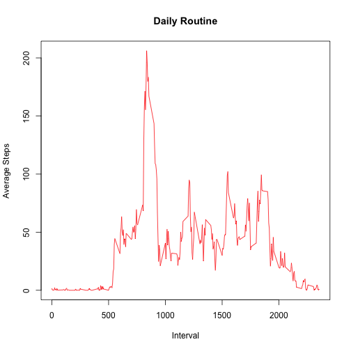

My First knitr Document

=======================

Download and read:


```r
if(!file.exists("./data")){dir.create("./data")}
fileUrl <- "https://d396qusza40orc.cloudfront.net/repdata%2Fdata%2Factivity.zip"
download.file(fileUrl, destfile = "./data/fitbit.zip", method = "curl")
unzip("./data/fitbit.zip", list = FALSE, overwrite = TRUE,
      junkpaths = FALSE, exdir = "./data", unzip = "internal",
      setTimes = FALSE)

fitbit <- read.csv("./data/activity.csv", sep = ",", header = TRUE)
```

Create a histogram:


```r
graph <- tapply(fitbit$steps,fitbit$date,sum)

hist(graph, breaks = 10, xlab = "Steps taken per day", main = paste("Histogram of Steps"))
```

 

Mean steps taken and Median:


```r
meansteps <- mean(graph, na.rm=TRUE)
mediansteps <- median(graph, na.rm=TRUE)
```

The mean is 1.0766189 &times; 10<sup>4</sup>. 
The median is 10765.


Create a time series plot with interval and average steps.


```r
routine <- tapply(fitbit$steps,fitbit$interval, mean, na.rm=TRUE)
intervaltime <- names(tapply(fitbit$steps,fitbit$interval, mean, na.rm=TRUE))
plot(routine~intervaltime, type = "l", xlab="Interval", ylab="Average Steps", col = "red", main = paste("Daily Routine"))
```

 


```r
max(routine)
```

```
## [1] 206.1698
```

This corresponds with interval 835-840!

Number of NA values:


```r
sum(is.na(fitbit$steps))
```

```
## [1] 2304
```

Strategy for filling missing data = mean for that 5 minute interval.


```r
fitbit$steps[is.na(fitbit$steps)] <- with(fitbit, ave(steps, interval, 
   FUN = function(x) mean(x, na.rm = TRUE)))[is.na(fitbit$steps)]
```

Create a new dataset with the new estimates.


```r
newdata <- fitbit
head(newdata)
```

```
##       steps       date interval
## 1 1.7169811 2012-10-01        0
## 2 0.3396226 2012-10-01        5
## 3 0.1320755 2012-10-01       10
## 4 0.1509434 2012-10-01       15
## 5 0.0754717 2012-10-01       20
## 6 2.0943396 2012-10-01       25
```

Draw a new histogram with the new data set!


```r
newgram <- tapply(newdata$steps,newdata$date,sum)

hist(newgram, breaks = 10, xlab = "Steps taken per day", main = paste("Histogram of Steps"))
```

 

Recalculate mean and median with new data set.


```r
newmeansteps <- mean(newgram, na.rm=TRUE)
newmediansteps <- median(newgram, na.rm=TRUE)
```

The new mean is 1.0766189 &times; 10<sup>4</sup>. 
The new median is 1.0766189 &times; 10<sup>4</sup>.

These values are very similar to before. 
NA values do not affect much.
